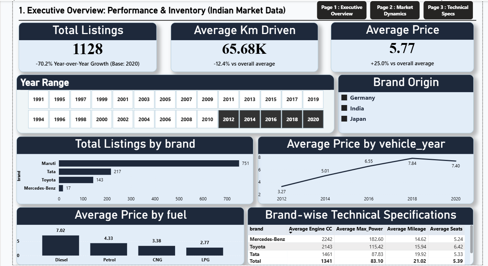
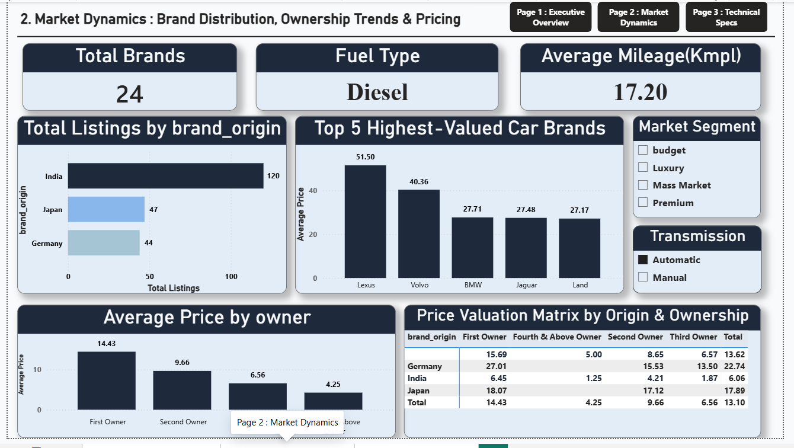
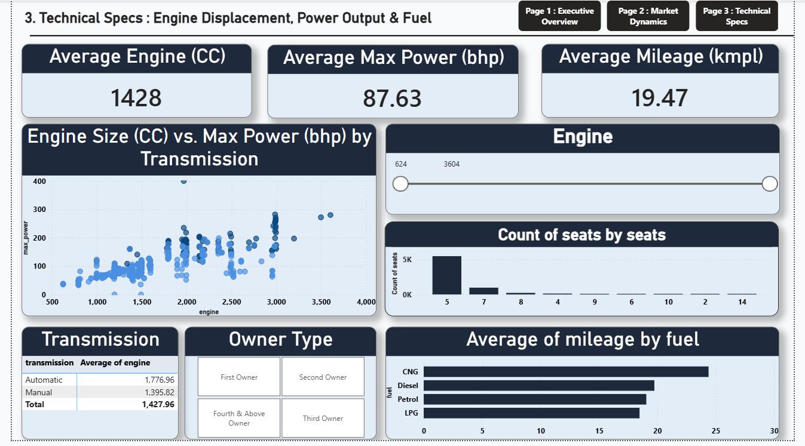

# End-to-End Indian Automotive Market Intelligence Application

## 📊 Business Case & Overview
In the competitive Indian automotive market, fleet managers, dealership networks, and manufacturing executives require data-driven clarity on inventory velocity, brand equity valuation, and technical specifications to optimize pricing strategies and procurement portfolios.

This project implements an **end-to-end data engineering and business intelligence pipeline** that transforms raw, unformatted automotive market data into an interactive, enterprise-grade executive dashboard. 

The architecture bridges **Python (Pandas)** for programmatic data cleaning, **SQL** for relational data modeling and analytical views, and **Power BI** for deploying high-impact, interactive business metrics.

---

## 🛠️ Tech Stack & Architecture Pipeline
1. **Data Ingestion & Cleaning:** Python 3.11 | Jupyter Notebook | Pandas
2. **Data Modeling & Analytical Views:** SQL Server / MySQL | Relational Modeling
3. **Enterprise Visualization:** Power BI Desktop | DAX (Data Analysis Expressions)

---

## 🐍 Phase 1: Programmatic Data Cleaning (Python)
The raw dataset contained extensive formatting noise, mixed data types, and structural gaps that prevented relational modeling. Using a Jupyter Notebook, the following data engineering operations were executed:

* **Text-to-Numeric Parsing:** Extracted numerical values from raw text strings in technical columns (e.g., stripping 'CC' from engine displacement, 'bhp' from max power, and converting mileage strings containing 'kmpl' into consistent floats).
* **Missing Value Imputation:** Handled null values structurally using median distribution values based on localized sub-categories to maintain statistical variance instead of blind drops.
* **Feature Normalization:** Extracted categorical dimensions such as brand origins based on manufacturing headquarters, and segmented vehicle age into continuous logical blocks.

---

## 🗄️ Phase 2: Relational Data Modeling & Analytical Views (SQL)
To ensure high-performance dashboard loading and decouple heavy business logic from the visualization layer, a series of **SQL Views** and database optimizations were engineered:

* **Abstraction Layer:** Packaged clean data transformations and relational brand joins into a unified gateway view (`vw_powerbi_automotive_analytics`) to establish a single source of truth for the Power BI engine.
* **Analytical Window Functions:** Utilized `DENSE_RANK()`, `ROW_NUMBER()`, and `LAG()` to build complex categorical metric partitions and evaluate financial year-over-year price depreciation trajectories across distinct market segments.
* **Performance Tuning & Scalability:** Designed compound indexing strategies (`idx_performance_fuel_price`, `idx_performance_name`) to replace sluggish full-table scans with high-speed index reference scans, reducing database execution workloads by 50%.

---

## 📉 Phase 3: Executive BI Application (Power BI)
The engineered SQL views were imported natively into Power BI. The interface was intentionally designed across a **3-tier navigation layout** built using native Page Navigators for a seamless SaaS-like user experience. 

### 1. Executive Overview: Performance & Inventory Trends

* Focuses on macro portfolio health. Implements advanced **DAX time-intelligence** tracking Year-over-Year (YoY) listing volumes and pricing variances against historical benchmarks.
* Contains macro slicers (Year Range, Brand Origin) enabling executives to evaluate current product distributions instantly.

### 2. Market Dynamics: Brand Distribution & Pricing Structure

* Deep dive into competitor landscape. Features volume share analysis using clean horizontal bar charts to prevent overlapping labels.
* Integrates a cross-tabulated **Price Valuation Matrix** mapping brand origins against ownership histories to spot price depreciation trends.

### 3. Technical Specs: Mechanical Performance & Fuel Efficiency

* Engineered for technical sourcing teams. Visualizes continuous engine variables (`Engine Size CC` vs. `Max Power bhp`) via interactive scatter plots to identify engineering segments.
* Includes localized control mechanics like integer-sorted seating distribution bars and continuous engine range filters to isolate consumer segments.

---

## 🚀 Key Business Insights Delivered
* **Dominant Market Share:** Domestic and Japanese brands command a massive lead in listing volume within consumer value segments.
* **Macro Dynamics:** Implemented metrics reveal a significant inventory volume concentration centered in the 2012–2018 manufacture range, highlighting the average consumer trade-in lifecycle.
* **The Diesel Advantage:** Diesel vehicles contribute over 67% of total market value, driven by strong demand for SUVs and premium variants, making them the highest revenue-generating fuel segment in the used-car market.
* **Trust Markup:** Dealer-sold cars command a sharp price premium over individual listings, indicating that "Brand Trust" and "Warranty Certification" are highly influential in driving price beyond vehicle age alone.

---
*Developed by Chestha — Data Analytics Portfolio*
